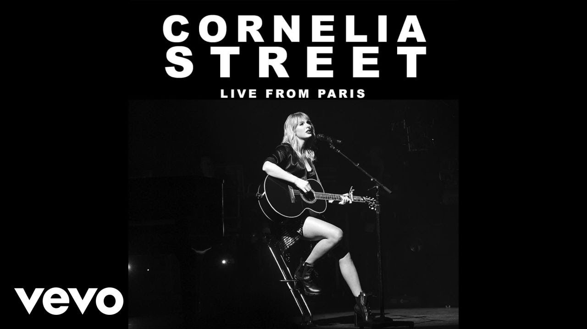

[Cornelia Street - Live From Paris](https://open.spotify.com/track/3fGnrtrtL1IHSX9t4DKOYf).
[Taylor Swift - All Too Well: The Short Film](https://www.youtube.com/watch?v=Vgt1d3eAm7A)

We were in the backseat

Drunk on something stronger

Than the drinks in the bar

"I rent a place on Cornelia Street"

I say casually in the car

We were a fresh page on the desk

Filling in the blanks as we go

As if the streetlights pointed in an arrowhead

Leading us home

And I hope I never lose you

Hope it never ends

I'd never walk Cornelia Street again

That's the kind of heartbreak time could never mend

I'd never walk Cornelia Street again

And baby, I get mystified by

How this city screams your name

And baby, I'm so terrified of if you ever walk away

I'd never walk Cornelia Street again

I'd never walk Cornelia Street again

♪
<!--truncate-->

Windows flung right open

Autumn air, jacket round my shoulders is yours

We bless the rains on Cornelia Street

Memorise the creaks in the floor

Back when we were card sharks, playing games

I thought you were leading me on

I packed my bags, left Cornelia Street

Before you even knew I was gone

♪

But then you called

Showed your hand

I turned around before I hit the tunnel

Sat on the roof, you and I

I hope I never lose you

Hope it never ends

I'd never walk Cornelia Street again

That's the kind of heartbreak time could never mend

I'd never walk Cornelia Street again

And baby, I get mystified by

How this city screams your name

And baby, I'm so terrified of if you ever walk away

I'd never walk Cornelia Street again

I'd never walk Cornelia Street again

♪

You hold my hand on the street

Walk me back to that apartment

Years ago, we were just inside

Barefoot in the kitchen

Sacred new beginnings

That became my religion

Listen...

I hope I never lose you

I'd never walk Cornelia Street again

Oh, never again

'Cause baby, I get mystified by

How this city screams your name

And baby, I'm so terrified of if you ever walk away

I'd never walk Cornelia Street again

I'd never walk Cornelia Street again

I don't wanna lose you

I don't wanna lose you

♪

"I rent a place on Cornelia Street"

I said casually in the car