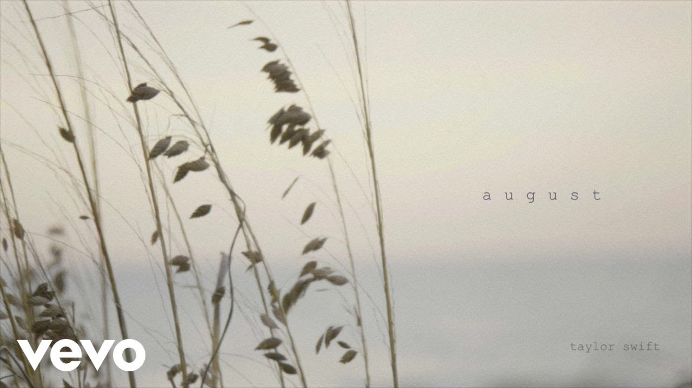

[august - the long pond studio sessions)](https://open.spotify.com/track/4MGexoZc12lqE0hYkq9YYx).
[Taylor Swift – august (Official Lyric Video)](https://www.youtube.com/watch?v=nn_0zPAfyo8).

Salt air

And the rust on your door

I never needed anything more

Whispers

Of "Are you sure?"

"Never have I ever before"

But I can see us

Lost in the memory

August slipped away into a moment in time

'Cause it was never mine

And I can see us twisted in bedsheets

August sipped away

Like a bottle of wine

'Cause you were never mine

Your back

Beneath the sun

Wishing I could write my name on it

Will you call when you're back at school?

I remember thinking I had you

But I can see us

Lost in the memory

August slipped away into a moment in time

'Cause it was never mine

And I can see us twisted in bedsheets

August sipped away

Like a bottle of wine

'Cause you were never mine

♪
<!--truncate-->

Back when we were still changing for the better

Wanting was enough

For me, it was enough

To live for the hope of it all

Cancel plans just in case you'd call

And say "Meet me behind the mall"

So much for summer love, and saying, "Us"

'Cause you weren't mine to lose

You weren't mine to lose

No

'Cause I can see us

Lost in the memory

August slipped away into a moment in time

'Cause it was never mine

And I can see us twisted in bedsheets

August sipped away

Like a bottle of wine

You were never mine, mine

You were never mine

Never mine

Do you remember?

Remember when I pulled up

And said, "Get in the car"

And then canceled my plans

Just in case you'd call

Back when I was living for the hope of it all

For the hope of it all

"Meet me behind the mall"

And then canceled my plans

Just in case you'd call

Back when I was living for the hope of it all, hope of it all

Remember when I pulled up

And said, "Get in the car"

And then canceled my plans

Just in case you'd call

Back when I was living for the hope of it all

For the hope of it all

"Meet me behind the mall"

